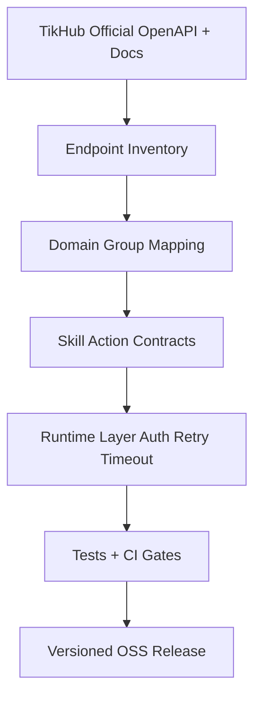

# 01 Skill Spec And Scope

Status: Draft v1.0  
Last Updated: 2026-03-06

## 1. Objective
Define the product scope, execution boundaries, and acceptance criteria for full TikHub API encapsulation into OpenClaw-compatible skills.

This document is the scope baseline for all follow-up design docs.

## 2. Problem Statement
TikHub exposes a large and evolving API surface. A full encapsulation effort can easily fail if scope and boundaries are not fixed before implementation.

This project needs:
- Full endpoint coverage target (no partial domain-only delivery).
- Repeatable skill packaging strategy for open-source collaboration.
- Explicit quality and release gates to avoid ad hoc wrappers.

## 3. Scope Definition

### 3.1 In Scope
- Encapsulate all publicly documented TikHub API endpoints from official OpenAPI and docs at implementation start date.
- Build OpenClaw skill packages that expose TikHub capabilities through stable action contracts.
- Provide shared runtime policies: auth injection, timeout, retry, rate-limit handling, and error normalization.
- Provide test assets, CI-ready validation strategy, and release documentation.
- Provide maintenance strategy for OpenAPI drift and version upgrades.

### 3.2 Out of Scope
- Any non-public, internal, reverse-engineered, or undocumented TikHub interfaces.
- Hosting a standalone web console for this repository.
- Replacing TikHub backend behavior or introducing custom business data persistence.
- Guaranteeing backward compatibility across major versions inside this repository (major versions may introduce breaking refactors, with changelog transparency).

## 4. Scope Boundaries And Principles

### 4.1 Source of Truth
- API contract source of truth: TikHub official OpenAPI + official docs.
- Skill contract source of truth: repository docs and versioned `SKILL.md` files.

### 4.2 Full-Coverage Principle
"Full encapsulation" means every eligible endpoint must be mapped to a documented skill action with:
- Parameter mapping.
- Validation rule.
- Response handling strategy.
- Error mapping entry.
- Test ownership tag.

### 4.3 Modular-But-Full Delivery Principle
To keep maintainability while meeting full coverage, delivery model is:
- One open-source repository.
- Multiple domain skill modules under the same release train.
- Optional aggregate entry skill for discovery/navigation.

This keeps implementation scalable without reducing scope.

## 5. High-Level Architecture Direction

## 6. Deliverables For Scope Phase
This phase must output:
- Approved scope matrix by endpoint domain.
- Repository-level naming and packaging rules.
- Unified acceptance checklist for implementation phases.
- Initial risk register and mitigation plan.

## 7. Decision Table (Phase-01)

| Decision Topic | Decision | Rationale | Impact |
|---|---|---|---|
| Packaging model | Multi-module skills in one repo | Full coverage is too large for a single monolithic skill file set | Better maintainability and ownership split |
| Coverage target | 100% of public documented endpoints | Aligns with project goal of full encapsulation | Larger initial workload but clear objective |
| Contract stability | Semantic versioning with explicit breaking releases | Avoid hidden behavioral drift | Consumers can pin versions |
| Data model strategy | Normalized action contract + optional raw passthrough mode (to be finalized in Doc 05) | Balance developer ergonomics and fidelity | Requires clear response envelope conventions |
| Compatibility policy | No strict backward compatibility across major versions | Project favors speed and correctness over legacy lock-in | Strong changelog discipline required |

## 8. Non-Functional Requirements (NFR)
- Reliability: default timeout and bounded retry required for all external calls.
- Performance: wrappers should add minimal overhead and avoid unnecessary payload inflation.
- Security: token must come from env/config only; never hardcode secrets in repo.
- Maintainability: each endpoint mapping must be traceable to source spec and test suite.
- Observability: structured logs and diagnosable error surfaces are mandatory.

## 9. Acceptance Criteria
Scope phase is accepted only when all conditions below are true:
- Scope boundary is approved (in-scope and out-of-scope clear, no ambiguity).
- Full endpoint inventory plan is locked for Doc 02 execution.
- Packaging strategy is agreed and actionable.
- NFR baseline is agreed and testable.
- Risks and constraints are documented with owners.

## 10. Risks And Mitigations

| Risk | Description | Mitigation |
|---|---|---|
| API drift | TikHub OpenAPI/docs change during implementation | Establish OpenAPI sync strategy in Doc 11 and weekly drift check |
| Rate-limit pressure | Large-scale validation may hit QPS limits | Add adaptive throttling and categorized test execution tiers |
| Inconsistent response shapes | Endpoint responses may vary significantly | Define strict normalization rules in Doc 05 |
| Secret leakage | Contributors may mis-handle tokens | Enforce env-only secrets, redaction rules, and contribution checks |
| Scope creep | New requests can derail full-coverage baseline | Change control via roadmap gates and versioned backlog |

## 11. Dependencies To Next Docs
- Doc 02 must build the complete endpoint inventory and mapping table from this scope baseline.
- Doc 03 must convert NFR reliability requirements into executable runtime policies.
- Doc 04 must implement the packaging and module decisions made here.

## 12. Exit Checklist
- [ ] Scope matrix approved
- [ ] Decision table approved
- [ ] NFR baseline approved
- [ ] Risk register approved
- [ ] Ready to start `02-API-INVENTORY-AND-MAPPING.md`
