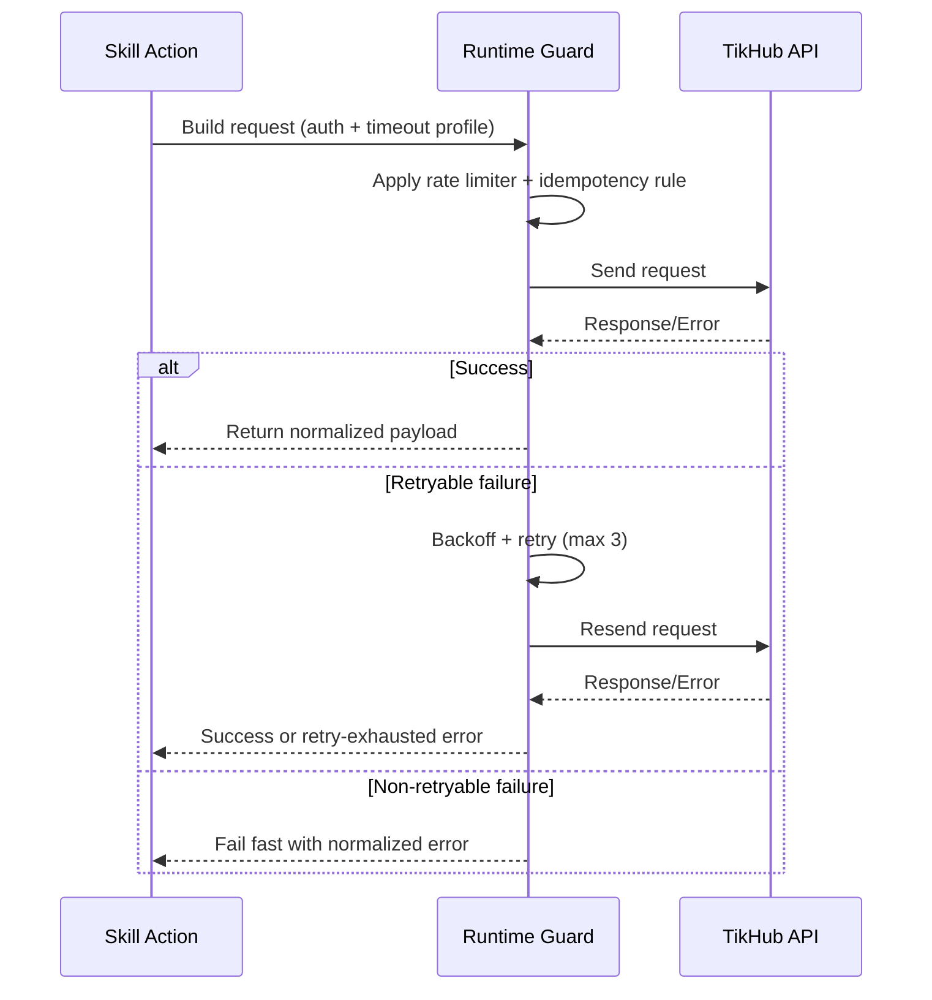

# 03 Auth Rate Limit And Retry

Status: Draft v1.0  
Last Updated: 2026-03-06

## 1. Objective
Define executable runtime policies for authentication, timeout, rate limiting, retry, and fail-fast behavior for all TikHub skill actions.

This document converts scope requirements into concrete runtime defaults.

## 2. Source Snapshot
- OpenAPI source: `https://api.tikhub.io/openapi.json`
- Snapshot date: 2026-03-06
- OpenAPI version: `3.1.0`
- API release version in description: `V5.3.2`
- API update time in description: `2026-03-04`
- Published runtime hints from API description:
  - Retry on error: `Max Retry: 3`
  - Timeout: `>=30s and <=60s`
  - Rate limit: `QPS: 10/Second`

## 3. Machine-Readable Runtime Indexes
This policy is backed by generated files:
- `03-NO-AUTH-ENDPOINTS.csv` (17 operations)
- `03-COOKIE-DEPENDENT-ENDPOINTS.csv` (45 operations)
- `03-SPECIAL-RATE-OR-RETRY-ENDPOINTS.csv` (23 operation-policy entries)

Generation command:
```bash
./scripts/generate_runtime_indexes.sh /tmp/tikhub-openapi.json .
```

## 4. Authentication Policy

### 4.1 Primary Auth Mode
- Required mode: `Authorization: Bearer <TIKHUB_API_KEY>`
- Token source: environment only (`TIKHUB_API_KEY`)
- Forbidden: hardcoded token, token in repository file, token printed in logs

### 4.2 Optional/Fallback Auth Mode
- TikHub documents cookie-based authorization as fallback.
- Repository default policy: do not use auth-cookie mode globally.
- Cookie usage is allowed only as endpoint payload field when endpoint requires user session context.

### 4.3 Endpoint Auth Coverage Baseline
- Bearer-protected operations: `970`
- No-auth operations: `17` (see `03-NO-AUTH-ENDPOINTS.csv`)
- Cookie-dependent request schemas: `45` operations (see `03-COOKIE-DEPENDENT-ENDPOINTS.csv`)
  - Distribution: `tiktok=22`, `douyin=19`, `xiaohongshu=3`, `bilibili=1`

### 4.4 Base URL Routing Policy
- Default base URL: `https://api.tikhub.io`
- Override via env: `TIKHUB_BASE_URL`
- For mainland China network constraints, operator may switch to `https://api.tikhub.dev`.
- Path and parameters remain unchanged when switching domain.

## 5. Timeout Policy

### 5.1 Global Limits
- Global timeout hard floor: `30000ms`
- Global timeout hard ceiling: `60000ms`
- Default timeout: `30000ms`

### 5.2 Timeout Profiles

| Profile | Timeout | Match Rule |
|---|---:|---|
| `STANDARD` | 30000ms | Default for all operations |
| `HEAVY_READ` | 45000ms | Large list/search/multi-fetch operations |
| `MEDIA_OR_LONG_TASK` | 60000ms | File upload and long-running task related operations |

### 5.3 Explicit Overrides From OpenAPI Notes
- TikTok Shop product/detail/search endpoints with explicit note use `30000ms` and keep `retry_on_400_3x` policy.
- Sora2 polling/upload endpoints must enforce at least 1 second interval (`rate_limit_1rps` entries in CSV).

## 6. Rate Limit Policy

### 6.1 Global Throughput Guard
- Default global limiter per API key: `10 req/s` token bucket.
- Default max in-flight requests: `5`.
- Burst allowance: `10` tokens.

### 6.2 Endpoint-Level Throttle Overrides
- Apply special per-endpoint throttle from `03-SPECIAL-RATE-OR-RETRY-ENDPOINTS.csv`.
- Current mandatory override:
  - `/api/v1/sora2/get_task_status`: minimum interval `1000ms`
  - `/api/v1/sora2/upload_image`: minimum interval `1000ms`

### 6.3 429 Handling
- If response is `429`, do not fail immediately.
- If `Retry-After` exists, honor it.
- Otherwise backoff with jitter and temporarily reduce concurrency by 50% for 30 seconds.

## 7. Retry Policy

### 7.1 Retry Budget
- Maximum retry attempts: `3` (excluding initial request).
- Backoff: exponential with full jitter.
- Suggested delays:
  - Attempt 1: random `0-500ms`
  - Attempt 2: random `0-1000ms`
  - Attempt 3: random `0-2000ms`
- Hard max delay per attempt: `8000ms`.

### 7.2 Retry Matrix

| Condition | Retry | Notes |
|---|---|---|
| DNS/network connection reset | Yes | Counts toward retry budget |
| Request timeout | Yes | Re-evaluate timeout profile |
| HTTP 400 | No by default | Exception: endpoints tagged `retry_on_400_3x` |
| HTTP 401/403 | No | Auth/config issue, fail fast |
| HTTP 404 | No | Treat as deterministic miss |
| HTTP 408 | Yes | Safe to retry with backoff |
| HTTP 422 | No | Validation issue, fix input |
| HTTP 429 | Yes | Honor Retry-After or jitter backoff |
| HTTP 500/502/503/504 | Yes | Retry with backoff |
| HTTP 302 redirect download | No retry loop | Follow redirect once, then fail |

### 7.3 Idempotency Guard
Automatic retry is allowed only for idempotent/safe operations.

Do not auto-retry operations tagged `no_auto_retry_non_idempotent`, including:
- `/api/v1/tiktok/interaction/apply`
- `/api/v1/tiktok/interaction/collect`
- `/api/v1/tiktok/interaction/follow`
- `/api/v1/tiktok/interaction/forward`
- `/api/v1/tiktok/interaction/like`
- `/api/v1/tiktok/interaction/post_comment`
- `/api/v1/tiktok/interaction/reply_comment`
- `/api/v1/sora2/create_video`
- `/api/v1/sora2/upload_image`

## 8. Circuit Breaker And Fail-Fast
- Open circuit when either condition is met:
  - 8 consecutive retry-exhausted failures, or
  - 60%+ failure rate over rolling 1 minute with at least 20 requests.
- Open duration: 30 seconds.
- Half-open probe: up to 3 trial requests.
- On half-open success >=2, close circuit; otherwise reopen.

## 9. Execution Flow



## 10. Required Runtime Configuration

| Env Var | Default | Purpose |
|---|---|---|
| `TIKHUB_API_KEY` | none | Bearer token |
| `TIKHUB_BASE_URL` | `https://api.tikhub.io` | API base URL |
| `TIKHUB_TIMEOUT_MS` | `30000` | Default timeout |
| `TIKHUB_MAX_RETRIES` | `3` | Retry budget |
| `TIKHUB_GLOBAL_QPS` | `10` | Global token-bucket rate |
| `TIKHUB_MAX_IN_FLIGHT` | `5` | Concurrency cap |

## 11. Acceptance Criteria
This phase is accepted only when:
- Runtime policies are deterministic and implementable as code.
- Generated CSV indexes are committed and reproducible.
- Retry and rate-limit exception sets are traceable to OpenAPI evidence.
- Non-idempotent operations are explicitly blocked from auto retry.
- Ready to execute `04-SKILL-ARCHITECTURE.md`.

## 12. Exit Checklist
- [ ] Auth policy approved
- [ ] Timeout profiles approved
- [ ] Retry matrix approved
- [ ] Special endpoint overrides approved
- [ ] Runtime env contract approved
