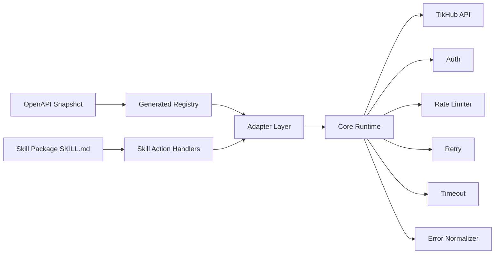
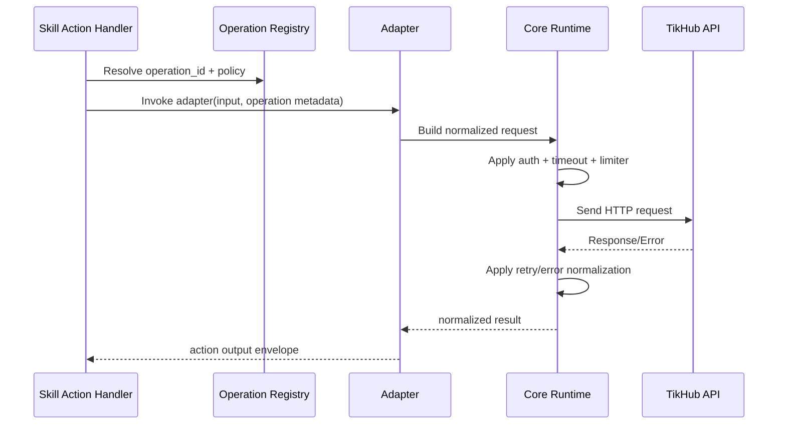

# 04 Skill Architecture

Status: Draft v1.0  
Last Updated: 2026-03-06

## 1. Objective
Define implementation architecture for maintainable full coverage (`987` operations), automated OpenAPI sync, and consistent runtime behavior across all TikHub skill packages.

This document finalizes module boundaries and dependency rules referenced by Doc 01-03.

## 2. Architecture Decisions

| Decision Topic | Final Decision | Why |
|---|---|---|
| Packaging model | Multi-skill packages in one repository | Supports full coverage without monolithic coupling |
| Runtime core | One shared core runtime library | Prevents duplicated auth/retry/rate-limit logic |
| Adapter strategy | One adapter per endpoint operation | Keeps mapping traceable to `operation_id` |
| Code generation mode | Hybrid: generated metadata + manual wrappers | Balances speed, control, and maintainability |
| Contract source | OpenAPI snapshot + generated CSV indexes | Reproducible and auditable |
| Dependency direction | `skills -> adapters -> core -> infra` (one-way) | Prevents cyclic dependency and drift |

## 3. Final Skill Partition (Locked)

| Skill Package | Platforms | Operation Count |
|---|---|---:|
| `skill-tikhub-core` | `health, tikhub, temp_mail, hybrid, ios_shortcut` | 14 |
| `skill-tikhub-douyin-family` | `douyin, xigua, toutiao, weibo, xiaohongshu` | 393 |
| `skill-tikhub-global-social` | `tiktok, instagram, twitter, threads, reddit, linkedin, youtube` | 396 |
| `skill-tikhub-video-community` | `bilibili, kuaishou, pipixia, lemon8, wechat_mp, wechat_channels, zhihu` | 158 |
| `skill-tikhub-experimental` | `sora2, demo` | 26 |
| **Total** | 26 platforms | **987** |

## 4. Target Repository Structure

```text
boi-skills-tikhub-api/
  skills/
    skill-tikhub-core/
      SKILL.md
    skill-tikhub-douyin-family/
      SKILL.md
    skill-tikhub-global-social/
      SKILL.md
    skill-tikhub-video-community/
      SKILL.md
    skill-tikhub-experimental/
      SKILL.md
  src/
    core/
      auth/
      http/
      retry/
      limiter/
      timeout/
      errors/
      logging/
      config/
    registry/
      operation-registry.ts
      policy-registry.ts
    adapters/
      <platform>/<module>/<operation>.ts
    skills/
      <skill-package>/
        action-index.ts
        action-handlers.ts
  generated/
    openapi/
      tikhub-openapi.snapshot.json
    inventory/
      02-API-INVENTORY.csv
      03-NO-AUTH-ENDPOINTS.csv
      03-COOKIE-DEPENDENT-ENDPOINTS.csv
      03-SPECIAL-RATE-OR-RETRY-ENDPOINTS.csv
    registry/
      operations.generated.json
      policies.generated.json
  scripts/
    generate_inventory.sh
    generate_runtime_indexes.sh
    generate_operation_registry.sh
```

## 5. Layered Component Model



## 6. Module Responsibilities

| Module | Responsibility | Inputs | Outputs |
|---|---|---|---|
| `generated-registry` | Stores operation metadata, auth/retry flags | OpenAPI + CSV indexes | machine-readable JSON registries |
| `core.config` | Resolves env/runtime settings | env vars | typed runtime config |
| `core.auth` | Injects Bearer token and protected headers | config + request | authenticated request |
| `core.http` | Performs low-level HTTP calls | normalized request | raw response/error |
| `core.retry` | Applies retry matrix and backoff | response/error + policy | retry decision |
| `core.limiter` | Enforces global/per-endpoint limits | operation id + key | permit/deny/wait |
| `core.errors` | Normalizes errors to stable format | raw response/error | normalized error envelope |
| `adapters.*` | Endpoint-specific request/response mapping | action input + registry | normalized output |
| `skills.*` | Exposes actions to OpenClaw skill interface | user task input | adapter invocation result |

## 7. Dependency Policy

Allowed dependencies:
- `skills/*` may depend on `adapters/*`, `registry/*`, `core/*`.
- `adapters/*` may depend on `registry/*`, `core/*`.
- `registry/*` may depend on generated files only.
- `core/*` may depend on `core/*` internal shared utilities.

Forbidden dependencies:
- `core/*` must not import `adapters/*` or `skills/*`.
- `adapters/*` must not import `skills/*`.
- Cross-skill direct imports are forbidden.
- Any module must not hardcode endpoint path/auth policy outside registry files.

## 8. Endpoint Execution Sequence



## 9. Adapter Contract
Every endpoint adapter must implement a shared contract:
- `operation_id` (immutable key)
- `action_name` (skill-facing key)
- `buildRequest(input, ctx)`
- `parseResponse(raw, ctx)`
- `validateInput(input)`
- `policyOverrides` (optional)

This ensures all `987` operations are pluggable through one execution engine.

## 10. Code Generation Strategy (Hybrid)

### 10.1 Generated Artifacts
Generate automatically from OpenAPI + CSV indexes:
- operation metadata registry (`path`, `method`, `operation_id`, `action_name`)
- auth flags (`requires_bearer`, `no_auth`, `cookie_dependent`)
- special runtime policies (`rate_limit_1rps`, `retry_on_400_3x`, `no_auto_retry_non_idempotent`)
- schema references for request/response mapping stubs

### 10.2 Manual Code
Manual implementation remains for:
- adapter request/response normalization
- complex field transformations
- compatibility aliases and response envelope shaping
- business-safe guardrails for non-idempotent endpoints

### 10.3 Why Hybrid
- full codegen is fast but brittle for heterogeneous payloads.
- full manual is precise but too costly at 987 operations.
- hybrid gives repeatability plus targeted control.

## 11. Runtime Policy Binding
Doc 03 runtime policy binds into architecture via `policy-registry`:
- `auth_mode`: bearer/no-auth/cookie-dependent
- `timeout_profile`: standard/heavy-read/media-or-long-task
- `retry_profile`: default/retry_on_400_3x/no_auto_retry_non_idempotent
- `rate_limit_profile`: global_10qps/rate_limit_1rps

No adapter may bypass policy registry.

## 12. Implementation Plan For Architecture

| Phase | Scope | Deliverable |
|---|---|---|
| A1 | Core runtime skeleton | `core/*` modules + config contract |
| A2 | Registry generation | generated operation/policy registries |
| A3 | Skill package skeletons | 5 skill package `SKILL.md` + action index |
| A4 | Pilot adapters | First 30 high-traffic operations (douyin+tiktok) |
| A5 | Scale rollout | Remaining adapters by B1-B5 slices from Doc 02 |

## 13. Risks And Mitigations

| Risk | Impact | Mitigation |
|---|---|---|
| Adapter explosion (987 files) | maintenance burden | enforce generator-backed registry and naming convention |
| Policy drift across modules | runtime inconsistency | all runtime policy from central policy registry |
| OpenAPI updates break adapters | regression risk | regenerate registry and run contract tests per update |
| Cross-module coupling | hard refactor | strict one-way dependency and lint rule |

## 14. Acceptance Criteria
Architecture phase is accepted when:
- package partition and directory structure are approved.
- dependency policy is enforceable and testable.
- shared adapter contract is approved.
- runtime policy binding path is defined end-to-end.
- ready to execute Doc 05 request/response standard.

## 15. Exit Checklist
- [ ] Skill partition approved
- [ ] Module boundaries approved
- [ ] Dependency policy approved
- [ ] Adapter contract approved
- [ ] Generation strategy approved
