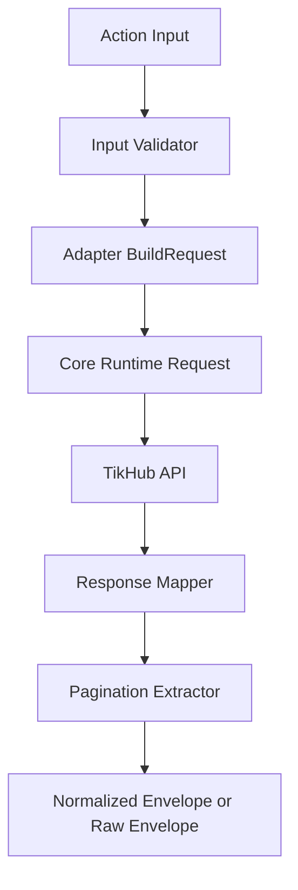

# 05 Request Response Standard

Status: Draft v1.0  
Last Updated: 2026-03-06

## 1. Objective
Define a uniform request and response contract for all `987` skill actions, including validation behavior, response envelope, pagination normalization, and raw passthrough mode.

This document resolves the pending contract decisions from Doc 01/04.

## 2. Source Snapshot
- OpenAPI source: `https://api.tikhub.io/openapi.json`
- Snapshot date: 2026-03-06
- OpenAPI version: `3.1.0`
- API info version: `V5.3.2`

## 3. Machine-Readable Contract Artifacts
Generated files:
- `05-CONTRACT-PROFILES.csv`
- `05-CONTRACT-SUMMARY-REQUEST.csv`
- `05-CONTRACT-SUMMARY-RESPONSE.csv`
- `05-CONTRACT-SUMMARY-PAGINATION.csv`
- `05-NONSTANDARD-RESPONSE-ENDPOINTS.csv`
- `05-MULTIPART-ENDPOINTS.csv`

Generation command:
```bash
./scripts/generate_contract_indexes.sh /tmp/tikhub-openapi.json .
```

## 4. Contract Baseline Statistics
- Total operations: `987`
- Request profiles:
  - `NONE=875`
  - `JSON=111`
  - `MULTIPART=1`
- Response profiles:
  - `RESPONSE_MODEL=981`
  - `CUSTOM_MODEL=4`
  - `INLINE_OR_NONE=1`
  - `REDIRECT=1`
- Pagination profiles:
  - `NONE=664`
  - `PAGE=115`
  - `CURSOR=104`
  - `OFFSET=64`
  - `MIXED=40`
- Operations with query params: `807`
- Operations with OpenAPI `422` validation response: `918`
- Cookie-related inputs:
  - query cookie operations: `18`
  - JSON body cookie operations: `45`

## 5. Decision Table (Locked)

| Topic | Decision |
|---|---|
| Canonical response mode | `normalized` is default |
| Raw passthrough mode | supported via `options.response_mode=raw` |
| Null policy | preserve upstream `null` as `null` |
| Missing field policy | do not synthesize missing fields |
| Empty collection policy | keep `[]` and `{}` unchanged |
| Request parameter naming | keep upstream field names (snake_case-first) |
| Metadata fields | always include core metadata in normalized mode |

## 6. Canonical Request Contract

### 6.1 Action Input Envelope
All actions use the same top-level input shape:

```json
{
  "operation": "tiktok.web.fetch_user_profile",
  "params": {
    "sec_user_id": "MS4wLjABAAA..."
  },
  "options": {
    "response_mode": "normalized",
    "include_meta": true,
    "timeout_ms": 30000,
    "idempotency_key": null
  }
}
```

### 6.2 Request Profile Mapping
- `NONE`: no request body; params come from query/path mapping.
- `JSON`: `application/json` request body.
- `MULTIPART`: `multipart/form-data` request body (currently only `/api/v1/sora2/upload_image`).

### 6.3 Input Validation Rules
- `operation` must exist in operation registry.
- `params` must be object.
- Unknown top-level keys are rejected.
- Unknown `params` keys:
  - default: pass-through allowed (for upstream forward compatibility).
  - strict mode (future flag): reject unknown keys.
- `timeout_ms` must stay inside runtime boundary from Doc 03.

### 6.4 Cookie-Related Input Rules
- Cookie is never read from repository config.
- Cookie must be explicitly provided in endpoint `params` when required.
- Cookie values are sensitive and must be masked in logs.

## 7. Canonical Response Contract

### 7.1 Normalized Envelope (Default)

```json
{
  "success": true,
  "operation_id": "fetch_user_profile_api_v1_tiktok_web_fetch_user_profile_get",
  "action_name": "tiktok.web.fetch_user_profile",
  "status": 200,
  "message": "Request successful.",
  "message_zh": "请求成功",
  "data": {},
  "meta": {
    "request_id": "...",
    "router": "/api/v1/tiktok/web/fetch_user_profile",
    "time": "...",
    "time_stamp": 0,
    "time_zone": "America/Los_Angeles",
    "docs": "...",
    "support": "Discord: ...",
    "cache": {
      "cache_url": null,
      "cache_message": null,
      "cache_message_zh": null
    },
    "pagination": {
      "type": "NONE",
      "has_more": null,
      "next_cursor": null,
      "next_offset": null,
      "next_page": null
    }
  },
  "error": null,
  "raw": null
}
```

### 7.2 Raw Passthrough Envelope
When `options.response_mode=raw`:
- still return top-level `success/status/error` for stability.
- `raw` contains untouched upstream payload/body.
- `data` may be `null`.

```json
{
  "success": true,
  "status": 200,
  "data": null,
  "raw": {
    "code": 200,
    "message": "...",
    "data": {}
  },
  "error": null
}
```

### 7.3 Mapping For Standard `ResponseModel`
For `981` operations using `#/components/schemas/ResponseModel`:
- `status <- code`
- `message <- message`
- `message_zh <- message_zh`
- `data <- data`
- `meta.request_id <- request_id`
- `meta.router <- router`
- `meta.time <- time`
- `meta.time_stamp <- time_stamp`
- `meta.time_zone <- time_zone`
- `meta.docs <- docs`
- `meta.support <- support`
- `meta.cache.* <- cache_url/cache_message/cache_message_zh`

### 7.4 Non-Standard Response Handling
Special handling list is maintained in `05-NONSTANDARD-RESPONSE-ENDPOINTS.csv` (6 operations).

Rules:
- `CUSTOM_MODEL`: map model fields into `data`, keep metadata if available.
- `INLINE_OR_NONE`: if body is non-JSON or empty, set `data=null`, preserve `raw` when requested.
- `REDIRECT`: return redirect target in `meta.redirect_location` and do not enter infinite redirect loop.

## 8. Pagination Normalization Standard

### 8.1 Unified Pagination Object
All responses include `meta.pagination`:
- `type`: `NONE | PAGE | OFFSET | CURSOR | MIXED`
- `has_more`: boolean/null
- `next_cursor`: string/null
- `next_offset`: integer/null
- `next_page`: integer/null

### 8.2 Extraction Priority
- `CURSOR`: read from common fields (`cursor`, `next_cursor`, `end_cursor`, `max_cursor`, `pagination_token`, `pcursor`, `continuation_token`).
- `OFFSET`: infer from `offset + limit/count` when possible.
- `PAGE`: infer from `page/page_size/count` and `has_more`.
- `MIXED`: populate all derivable fields; do not discard upstream tokens.

## 9. Error Payload Contract
All failures return stable error shape:

```json
{
  "success": false,
  "status": 422,
  "error": {
    "category": "VALIDATION_ERROR",
    "retryable": false,
    "upstream_code": 422,
    "message": "Validation Error",
    "details": [
      {
        "loc": ["query", "aweme_id"],
        "msg": "field required",
        "type": "missing"
      }
    ]
  }
}
```

Category baseline:
- `AUTH_ERROR`
- `PERMISSION_ERROR`
- `VALIDATION_ERROR`
- `RATE_LIMITED`
- `UPSTREAM_5XX`
- `NETWORK_ERROR`
- `TIMEOUT`
- `UNKNOWN_ERROR`

Detailed taxonomy is finalized in Doc 06.

## 10. Serialization And Field Naming Rules
- Request `params` keys: keep upstream names exactly.
- Response `data`: preserve upstream naming and structure.
- Contract wrapper fields use `snake_case` for consistency.
- Numbers remain numeric; no implicit string-number coercion.
- Date/time strings are not auto-converted.

## 11. Contract Execution Flow



## 12. Acceptance Criteria
This phase is accepted when:
- request/response envelope is stable and implementable.
- raw mode behavior is explicit and testable.
- null/missing/empty policies are explicit.
- non-standard response endpoints are tracked in generated CSV.
- pagination normalization rules cover all profile types.
- ready to execute Doc 06 error model.

## 13. Exit Checklist
- [ ] Request envelope approved
- [ ] Response envelope approved
- [ ] Raw mode approved
- [ ] Pagination normalization approved
- [ ] Null/empty policy approved
