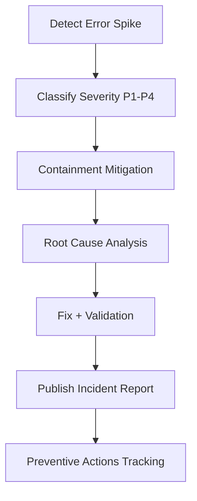

# 06 Error Model And Incident

Status: Draft v1.0  
Last Updated: 2026-03-06

## 1. Objective
Define a deterministic error taxonomy, normalization rules, and incident workflow for all `987` TikHub skill operations.

This document finalizes the error model referenced by Doc 03 and Doc 05.

## 2. Source Snapshot
- OpenAPI source: `https://api.tikhub.io/openapi.json`
- Snapshot date: 2026-03-06
- OpenAPI version: `3.1.0`
- API info version: `V5.3.2`

## 3. Machine-Readable Error Artifacts
Generated files:
- `06-ERROR-SURFACES.csv`
- `06-ERROR-STATUS-SUMMARY.csv`
- `06-NO-422-ENDPOINTS.csv`
- `06-NO-422-SUMMARY-BY-PLATFORM.csv`

Static governance files:
- `06-ERROR-CATEGORY-MAPPING.csv`
- `06-INCIDENT-REPORT-TEMPLATE.md`

Generation command:
```bash
./scripts/generate_error_indexes.sh /tmp/tikhub-openapi.json .
```

## 4. Error Surface Baseline
- Total operations: `987`
- Declared HTTP statuses:
  - `200`: 986 operations
  - `302`: 1 operation
  - `422`: 918 operations
- Operations without declared `422`: `69`
- Redirect-profile operations: `1`
  - `/api/v1/tikhub/downloader/redirect_download`

Top `no-422` platform distribution:
- `douyin=15`
- `weibo=11`
- `demo=9`
- `tiktok=7`
- `tikhub=6`

## 5. Canonical Error Envelope
All failure responses must follow this shape:

```json
{
  "success": false,
  "status": 422,
  "operation_id": "fetch_post_detail_api_v1_tiktok_web_fetch_post_detail_get",
  "action_name": "tiktok.web.fetch_post_detail",
  "error": {
    "category": "VALIDATION_ERROR",
    "retryable": false,
    "severity": "medium",
    "upstream_http_status": 422,
    "upstream_code": 422,
    "code": "VALIDATION_ERROR",
    "message": "Validation Error",
    "message_zh": "参数校验失败",
    "details": [],
    "hints": [
      "Check required fields and field types."
    ]
  },
  "meta": {
    "request_id": "...",
    "router": "/api/v1/tiktok/web/fetch_post_detail",
    "time": "..."
  },
  "raw": null
}
```

## 6. Error Classification Rules

### 6.1 Classification Priority
1. Runtime-level failures (`TIMEOUT`, `NETWORK_ERROR`, `CIRCUIT_OPEN`)  
2. HTTP status-based classification (`401`, `403`, `422`, `429`, `5xx`, etc.)  
3. Upstream application-level classification (HTTP 2xx but `upstream_code` abnormal)  
4. Contract parsing/classification failures (`CONTRACT_VIOLATION`)  
5. Fallback (`UNKNOWN_ERROR`)

### 6.2 Success Determination Rule
A response is considered success only when all conditions pass:
- HTTP status is 2xx or expected redirect handled correctly.
- If response body has `code`, then `code` must be in `[0, 200]`.
- Adapter parsing and contract validation must succeed.

If any condition fails, normalize into canonical error envelope.

### 6.3 Category Mapping
Category mapping is maintained in `06-ERROR-CATEGORY-MAPPING.csv` and includes:
- `AUTH_ERROR`
- `PERMISSION_ERROR`
- `VALIDATION_ERROR`
- `BAD_REQUEST`
- `NOT_FOUND`
- `RATE_LIMITED`
- `BILLING_ERROR`
- `UPSTREAM_5XX`
- `TIMEOUT`
- `NETWORK_ERROR`
- `CIRCUIT_OPEN`
- `REDIRECT_ERROR`
- `UPSTREAM_APP_ERROR`
- `CONTRACT_VIOLATION`
- `UNKNOWN_ERROR`

## 7. Retryability Binding Rules
Retryability is derived from Doc 03 and category mapping:
- Retryable by default: `RATE_LIMITED`, `UPSTREAM_5XX`, `TIMEOUT`, `NETWORK_ERROR`, `CIRCUIT_OPEN`.
- Not retryable by default: `AUTH_ERROR`, `PERMISSION_ERROR`, `VALIDATION_ERROR`, `BAD_REQUEST`, `NOT_FOUND`, `BILLING_ERROR`, `UPSTREAM_APP_ERROR`, `CONTRACT_VIOLATION`.
- Endpoint-level no-auto-retry rules from `03-SPECIAL-RATE-OR-RETRY-ENDPOINTS.csv` always override category defaults.

## 8. User-Facing Error Message Policy
- Prefer upstream bilingual fields when available (`message`, `message_zh`).
- If no Chinese message exists, keep English message and attach Chinese fallback hint.
- Never expose secrets or raw credential-like fields.
- Always include actionable hint(s) for non-retryable errors.
- For retryable errors, include suggested backoff window.

## 9. Logging Redaction Rules
Mandatory masking targets:
- `Authorization` header/token
- `cookie` and any cookie-like fields
- API keys and bearer strings
- session identifiers and signed URLs with credentials

Redaction policy:
- Keep first 4 and last 2 characters only when partial display is necessary.
- Replace full sensitive values with `***REDACTED***` in logs and incident reports.
- Do not store raw request bodies for endpoints flagged as cookie-dependent.

## 10. Incident Severity Model

| Severity | Trigger | Initial Response SLA |
|---|---|---|
| `P1` | Widespread outage, auth collapse, or sustained circuit-open across major packages | 15 minutes |
| `P2` | High error rate in one major package or repeated retry exhaustion | 1 hour |
| `P3` | Localized endpoint/platform issue with workaround | 4 hours |
| `P4` | Low-impact bug, docs mismatch, or non-critical contract drift | 1 business day |

## 11. Incident Workflow



Operational steps:
- Detect via alerts, CI, or user report.
- Correlate by `operation_id`, `category`, `request_id`, and package.
- Apply mitigation (throttle, rollback, hotfix, or temporary disable).
- Verify recovery using contract tests and representative requests.
- File incident report using `06-INCIDENT-REPORT-TEMPLATE.md`.
- Track and close preventive actions.

## 12. Incident Report Requirements
Every incident report must include:
- exact impacted operation IDs
- timeline with UTC timestamps
- root cause and contributing factors
- mitigation and verification evidence
- prevention actions with owner and ETA

## 13. Acceptance Criteria
This phase is accepted when:
- error envelope is deterministic across runtime and adapter failures.
- category mapping table is complete and actionable.
- redaction rules are explicit and enforceable.
- incident workflow is executable by maintainers.
- ready to execute Doc 07 test strategy.

## 14. Exit Checklist
- [ ] Error envelope approved
- [ ] Category mapping approved
- [ ] Redaction policy approved
- [ ] Incident severity model approved
- [ ] Incident template approved
