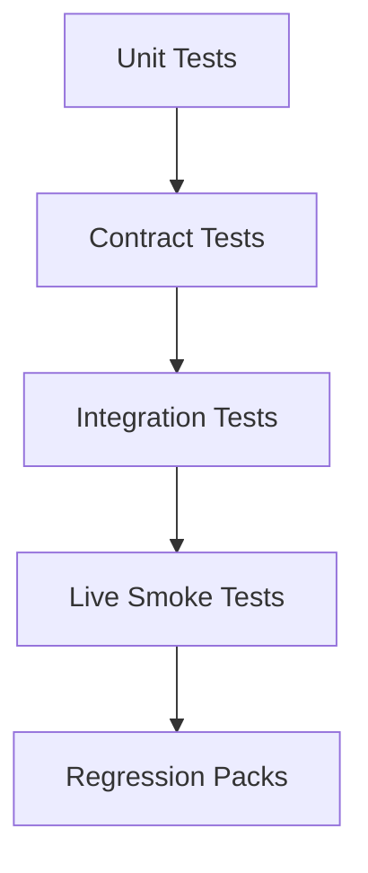

# 07 Test Strategy

Status: Draft v1.0  
Last Updated: 2026-03-06

## 1. Objective
Define executable quality gates for unit, contract, integration, live-smoke, and regression testing across all `987` operations.

This document turns architecture and contract decisions into CI-enforceable test standards.

## 2. Source Baseline
- OpenAPI snapshot: 2026-03-06 (`V5.3.2`)
- Inventory baseline: `987` operations
- Skill packages: `5`

## 3. Machine-Readable Test Artifacts
Generated files:
- `07-TEST-MATRIX.csv`
- `07-TEST-SUMMARY-BY-TIER.csv`
- `07-TEST-SUMMARY-BY-PACKAGE.csv`
- `07-CRITICAL-OPERATIONS.csv`

Generation command:
```bash
./scripts/generate_test_indexes.sh .
```

## 4. Test Tier Baseline
Current matrix split:
- `critical`: `132`
- `high`: `382`
- `standard`: `473`

By package:
- `skill-tikhub-core`: `critical=5`, `high=5`, `standard=4`
- `skill-tikhub-douyin-family`: `critical=68`, `high=139`, `standard=186`
- `skill-tikhub-global-social`: `critical=49`, `high=152`, `standard=195`
- `skill-tikhub-video-community`: `critical=7`, `high=68`, `standard=83`
- `skill-tikhub-experimental`: `critical=3`, `high=18`, `standard=5`

## 5. Decision Table (Locked)

| Topic | Decision |
|---|---|
| Live API tests in PR CI | No (mocked/contract-only in PR) |
| Live API tests execution | Nightly + manual workflow dispatch |
| Snapshot testing | Allowed only for stable contract envelopes and redacted fixtures |
| Minimum coverage threshold | `core >= 90%`, `adapters >= 80%` |
| Contract coverage target | `100% operation_id` coverage in contract suite |
| Critical tier requirement | Must include integration and live-smoke coverage plan |

## 6. Test Pyramid



### 6.1 Unit Tests
Scope:
- `core/*` runtime modules (auth, retry, limiter, timeout, error mapping)
- adapter pure mapping helpers
- policy selection logic

Characteristics:
- fully mocked transport
- deterministic inputs/outputs
- fastest gate in CI

### 6.2 Contract Tests
Scope:
- request envelope serialization
- response envelope normalization
- error envelope normalization
- pagination normalization

Characteristics:
- driven by `operation_id`
- validates against generated registries and fixture payloads
- ensures schema drift is detected early

### 6.3 Integration Tests
Scope:
- skill handler -> adapter -> core runtime orchestration
- retry/timeout/rate-limit behavior with mocked upstream server
- non-idempotent guard and redirect behavior

Characteristics:
- run in CI on PR and main branch
- no real external API call required

### 6.4 Live Smoke Tests
Scope:
- selected critical operations using real TikHub API
- auth path, connectivity, and baseline response validity

Characteristics:
- run nightly and manual trigger only
- requires secrets and budget controls
- flaky-safe with retry budget and strict timeout

### 6.5 Regression Packs
Scope:
- incident-derived test cases (from Doc 06 reports)
- previously broken adapters or policies

Characteristics:
- mandatory for bugfix PRs
- cannot be deleted without maintainer approval

## 7. Required Test Suites By Tier
From `07-TEST-MATRIX.csv`:
- `critical` operations require: `unit|contract|integration|live_smoke|regression`
- `high` operations require: `unit|contract|integration|regression`
- `standard` operations require: `unit|contract`

## 8. CI Pipeline And Gates

### 8.1 Pipeline Stages
1. `Stage A`: static checks + generator consistency (`scripts/*.sh` outputs unchanged)
2. `Stage B`: unit tests
3. `Stage C`: contract tests (must cover all `operation_id` in registry)
4. `Stage D`: integration tests
5. `Stage E`: nightly/manual live smoke tests

### 8.2 Hard Gates
- Gate 1: `02-API-INVENTORY.csv` row count equals `07-TEST-MATRIX.csv` row count.
- Gate 2: Contract tests must include every `operation_id` (`100%`).
- Gate 3: `core` coverage >= `90%` lines.
- Gate 4: `adapters` coverage >= `80%` lines.
- Gate 5: Critical-tier operations must have integration test mapping.
- Gate 6: Generator scripts produce no drift in tracked CSVs.

### 8.3 Soft Gates (warning-only initially)
- High-tier integration coverage ratio < `80%`.
- Live smoke pass rate < `95%` over 7-day rolling window.

## 9. Fixture And Mocking Strategy
- Store fixtures by `operation_id` under versioned fixture directories.
- Keep both success and representative failure payloads (`422`, `429`, `5xx`, timeout simulation).
- Redact all secrets before fixture commit.
- Snapshot files are allowed only for normalized envelopes, not raw upstream blobs with volatile fields.

## 10. Ownership Model
- Each skill package owns adapter and integration test coverage for its platform set.
- Core runtime team owns `core/*` unit/integration suites and cross-cutting contract tests.
- Incident owner must add regression test cases before incident closure.

## 11. Live Smoke Scope Strategy
- Start with top-risk operations from `07-CRITICAL-OPERATIONS.csv`.
- Initial live smoke target: `>=30` critical operations, covering all 5 skill packages.
- Expand live smoke set as reliability budget allows.

## 12. Incident Feedback Loop
Every P1/P2 incident from Doc 06 must produce:
- at least 1 new regression test
- updated mapping in test matrix if risk tier changed
- post-fix verification evidence in CI logs

## 13. Acceptance Criteria
This phase is accepted when:
- test matrix is generated and reproducible.
- tier-to-suite requirements are explicit and enforceable.
- CI gates and coverage thresholds are documented.
- live smoke policy is bounded and operational.
- ready to execute Doc 08 security/compliance.

## 14. Exit Checklist
- [ ] Test matrix approved
- [ ] CI gates approved
- [ ] Coverage thresholds approved
- [ ] Live smoke strategy approved
- [ ] Regression policy approved
