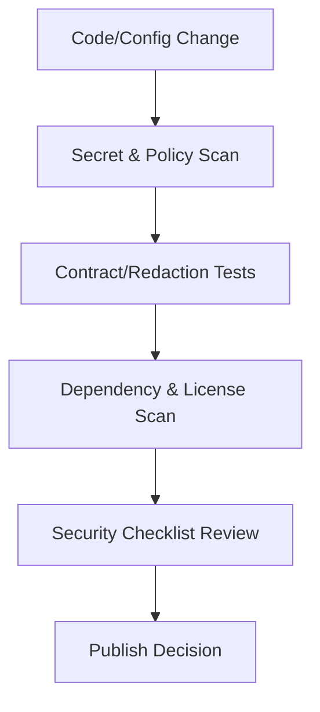

# 08 Security And Compliance

Status: Draft v1.0  
Last Updated: 2026-03-06

## 1. Objective
Define enforceable security and compliance controls for secrets, sensitive data handling, logging, dependency hygiene, and OSS publication safety.

This document provides the publish-safe baseline for the TikHub skill repository.

## 2. Source Baseline
- OpenAPI snapshot: 2026-03-06 (`V5.3.2`)
- Total operations: `987`
- Auth split from prior docs:
  - Bearer-protected: `970`
  - No-auth: `17`
  - Cookie-dependent: `45`

## 3. Machine-Readable Security Artifacts
Generated files:
- `08-SECURITY-CLASSIFICATION.csv`
- `08-SECURITY-SUMMARY-BY-RISK.csv`
- `08-SECURITY-SUMMARY-BY-PACKAGE.csv`
- `08-SECRET-SURFACES.csv`

Generation command:
```bash
./scripts/generate_security_indexes.sh .
```

## 4. Security Baseline Metrics
- Security risk tier split:
  - `CRITICAL=46`
  - `HIGH=31`
  - `MEDIUM=910`
- Secret scope split:
  - `API_KEY+COOKIE=45`
  - `API_KEY=925`
  - `NONE=17`
- Secret-touching operations: `970`

## 5. Threat Model (Repository Scope)
Primary risks:
- Secret leakage (`TIKHUB_API_KEY`, cookie/session values).
- Unsafe logging (credentials, signed URLs, raw cookie-bearing payloads).
- Dependency supply-chain compromise.
- Insecure contribution path (malicious PR introducing exfiltration logic).
- Abuse risk on no-auth and high-frequency endpoints.

Out of scope:
- TikHub upstream infrastructure security.
- End-user client/browser security.

## 6. Secret Management Standard

### 6.1 Supported Injection Methods
Allowed:
- Local `.env` (development only, gitignored).
- CI secret env variables.
- External secret managers injected into runtime env.

Forbidden:
- Hardcoded secrets in source code, fixtures, docs, or tests.
- Storing valid production tokens in issue/PR comments.
- Echoing raw secrets in logs.

### 6.2 Required Secret Variables
- `TIKHUB_API_KEY` (required for authenticated operations)
- Optional runtime endpoint variables:
  - `TIKHUB_BASE_URL`
  - `TIKHUB_FALLBACK_BASE_URL`

### 6.3 Rotation Policy
- Rotate exposed secrets immediately.
- For routine hygiene, rotate API keys at least every 90 days.
- Incident-triggered rotation is mandatory for P1/P2 secret exposure events.

## 7. Sensitive Data And Logging Policy

### 7.1 Sensitive Field Classes
- Class S1 (strict): `Authorization`, `cookie`, API key, session-like fields.
- Class S2 (masked): user identifiers and platform account identifiers where traceability is needed.
- Class S3 (allowed with care): non-sensitive metadata and aggregate counters.

### 7.2 Redaction Rules
- S1: always `***REDACTED***`.
- S2: partial mask (`first4...last2`) when needed.
- S3: no masking required unless policy escalation applies.
- Cookie-dependent request bodies must not be logged raw.

### 7.3 Log Retention Guidance
- Runtime debug logs containing request context: max 7 days.
- Aggregated error metrics without sensitive payload: up to 90 days.
- Incident reports must use redacted excerpts only.

## 8. Data Handling And Storage Policy
- Repository is stateless by design; do not persist upstream payloads by default.
- Fixture data must be synthetic or redacted before commit.
- Multipart-upload test artifacts must not include real personal/private images.
- Do not store downloaded upstream assets in version control.

## 9. Dependency And Supply-Chain Security

### 9.1 Dependency Policy
- Pin lockfiles and avoid floating major ranges.
- Add dependencies only with explicit justification and maintainer review.
- Remove unused dependencies promptly.

### 9.2 Security Scanning Baseline
Mandatory CI checks once implementation code exists:
- Secret scan (e.g., `gitleaks` or equivalent).
- SCA vulnerability scan (e.g., `osv-scanner`/ecosystem-native audit).
- License scan for dependency graph.

### 9.3 Failing Conditions
Security gate must fail when:
- leaked secret patterns detected.
- high/critical known vulnerabilities without approved exception.
- disallowed licenses detected by policy baseline.

## 10. License And OSS Compliance Policy
- Repository license: MIT (already present).
- All added third-party code/assets must include compatible license notice.
- No proprietary SDK binaries or closed-source assets committed.
- Contributor must confirm that submitted code is redistributable.

## 11. CI Security Gates

| Gate | Rule | Enforcement |
|---|---|---|
| `SEC-1` | No secret leaks in git history and diff | hard fail |
| `SEC-2` | Redaction tests pass for S1/S2 fields | hard fail |
| `SEC-3` | Security classification matrix regenerates cleanly | hard fail |
| `SEC-4` | Critical-risk operations have security test coverage tag | hard fail |
| `SEC-5` | Vulnerability/license scan within policy threshold | hard fail |

## 12. Incident Integration (With Doc 06)
Security incidents follow Doc 06 severity workflow plus:
- immediate secret revocation/rotation if S1 exposure suspected.
- mandatory incident report using `06-INCIDENT-REPORT-TEMPLATE.md`.
- add regression security tests before closure.

## 13. Publication Safety Checklist
Pre-release execution checklist is maintained in:
- `08-PUBLISH-SECURITY-CHECKLIST.md`

No public release is allowed until checklist is fully passed.

## 14. Security Control Flow



## 15. Acceptance Criteria
This phase is accepted when:
- secret handling rules are explicit and enforceable.
- redaction and logging retention policies are documented.
- dependency and license scanning baseline is fixed.
- publish-safe checklist exists and is actionable.
- ready to execute Doc 09 release/versioning.

## 16. Exit Checklist
- [ ] Secret management standard approved
- [ ] Redaction policy approved
- [ ] Dependency/license baseline approved
- [ ] CI security gates approved
- [ ] Publish checklist approved
