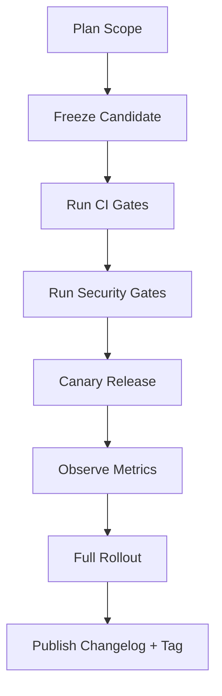

# 09 Release Versioning And Changelog

Status: Draft v1.0  
Last Updated: 2026-03-06

## 1. Objective
Define release lifecycle, semantic versioning rules, changelog structure, and rollout strategy for full-coverage TikHub skills.

This document provides a no-tribal-knowledge release standard for maintainers.

## 2. Source Baseline
- Total operations: `987`
- Skill packages: `5`
- Release-risk baseline generated from testing/security matrices.

## 3. Machine-Readable Release Artifacts
Generated files:
- `09-RELEASE-BASELINE-BY-PACKAGE.csv`
- `09-RELEASE-PRIORITY-BY-PACKAGE.csv`

Generation command:
```bash
./scripts/generate_release_indexes.sh .
```

## 4. Release Priority Baseline
Current package release-risk order:
1. `skill-tikhub-douyin-family` (score `431`)
2. `skill-tikhub-global-social` (score `413`)
3. `skill-tikhub-video-community` (score `93`)
4. `skill-tikhub-experimental` (score `53`)
5. `skill-tikhub-core` (score `34`)

Recommended rollout:
- Order 1-2: canary-first then gradual.
- Order 3-4: standard staged release.
- Order 5: fast-follow release.

## 5. Versioning Policy

### 5.1 Versioning Unit
- Each skill package is independently versioned using SemVer: `MAJOR.MINOR.PATCH`.
- Repository may also publish a meta release tag that references package versions.

### 5.2 Bump Rules
- `PATCH`: bug fixes, internal refactor, non-contract security hardening.
- `MINOR`: backward-compatible action additions or optional field additions.
- `MAJOR`: breaking contract changes, removals, behavior default changes, or policy changes requiring consumer updates.

### 5.3 Compatibility Note
Doc 01 states strict backward compatibility is not required across major versions.  
This does not remove the obligation to clearly mark breaking changes in changelog and release notes.

## 6. Breaking Change Policy
A change is `breaking` if any of the following occurs:
- action name removed/renamed
- required input parameter changed or newly required
- response envelope contract changed incompatibly
- retry/auth behavior change that can alter consumer semantics
- package split/merge requiring import or config migration

Breaking changes must include:
- explicit migration guide section
- old/new contract examples
- impact scope (`operation_id` list or deterministic matching rule)

## 7. Pre-Release Channel Strategy
- `alpha`: rapid validation channel; may include unstable changes.
- `beta`: feature-complete candidate; contract expected stable.
- `rc`: release candidate with change freeze except blocker fixes.

Promotion path:
`alpha -> beta -> rc -> stable`

## 8. Deprecation Policy
- Standard deprecation notice window: at least 1 minor release cycle or 14 days, whichever is longer.
- Security/emergency removals may bypass notice window, but must include incident-linked rationale.
- Deprecated actions must be tagged in changelog until removal.

## 9. Release Lifecycle



## 10. Release Gates
Hard requirements before stable release:
- all mandatory CI gates from Doc 07 pass.
- security checklist from Doc 08 passes.
- generator output files are up to date and committed.
- changelog entry completed with impact labels.
- release checklist completed (`09-RELEASE-CHECKLIST.md`).

## 11. Changelog Standard

### 11.1 Required Sections
- `Added`
- `Changed`
- `Fixed`
- `Security`
- `Deprecated`
- `Removed`
- `Docs`
- `Internal`

### 11.2 Required Metadata Per Release
- release date (UTC)
- package/version map
- affected skill packages
- affected operation counts
- breaking change flag
- migration notes (if needed)

### 11.3 Impact Annotation Rules
Every non-doc entry should include at least one:
- `operation_id`
- `action_name`
- `skill_package`

## 12. Tagging Convention
- Package tag format: `<skill-package>@<semver>`
- Meta tag format: `release-YYYYMMDD-<seq>`

Examples:
- `skill-tikhub-global-social@1.2.0`
- `release-20260306-01`

## 13. Rollback Policy
- Maintain rollback target for previous stable package version.
- If canary fails critical criteria, stop rollout and revert affected package tags.
- Record rollback reason in changelog and incident notes.

## 14. Release Governance Files
Operational templates:
- `09-RELEASE-CHECKLIST.md`
- `09-CHANGELOG-TEMPLATE.md`

## 15. Acceptance Criteria
This phase is accepted when:
- version bump rules are deterministic and documented.
- breaking/deprecation policy is explicit.
- release gates are aligned with Doc 07 and Doc 08.
- changelog schema is complete and enforceable.
- ready to execute Doc 10 observability/operations.

## 16. Exit Checklist
- [ ] SemVer policy approved
- [ ] Breaking/deprecation policy approved
- [ ] Release gates approved
- [ ] Changelog template approved
- [ ] Rollback policy approved
