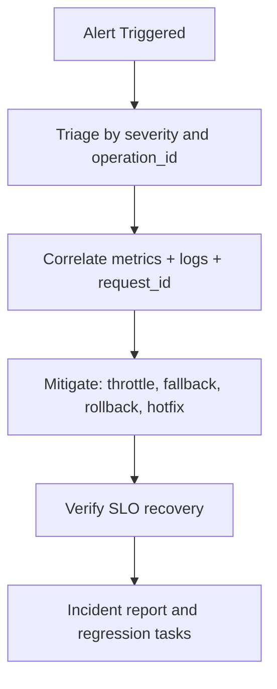

# 10 Observability And Operations

Status: Draft v1.0  
Last Updated: 2026-03-06

## 1. Objective
Define enforceable observability and operations standards for all `987` TikHub skill operations, including SLO tiers, telemetry schema, alert baselines, and incident run procedures.

This document converts test/security baselines into production-operable signals and playbooks.

## 2. Source Baseline
- OpenAPI snapshot date: `2026-03-06` (`V5.3.2`)
- Inventory baseline: `987` operations
- Inputs from prior phases:
  - test tiers (`07-TEST-MATRIX.csv`)
  - security risk tiers (`08-SECURITY-CLASSIFICATION.csv`)
  - error category defaults (`06-ERROR-CATEGORY-MAPPING.csv`)

## 3. Machine-Readable Observability Artifacts
Generated files:
- `10-OBSERVABILITY-MATRIX.csv`
- `10-OBSERVABILITY-SUMMARY-BY-SLO.csv`
- `10-OBSERVABILITY-SUMMARY-BY-PACKAGE.csv`
- `10-ALERT-CATALOG.csv`

Generation command:
```bash
./scripts/generate_observability_indexes.sh .
```

## 4. Baseline Metrics

### 4.1 SLO Tier Split
- `SLO1=132`
- `SLO2=382`
- `SLO3=473`

### 4.2 By Package
- `skill-tikhub-core`: `SLO1=5`, `SLO2=5`, `SLO3=4`
- `skill-tikhub-douyin-family`: `SLO1=68`, `SLO2=139`, `SLO3=186`
- `skill-tikhub-global-social`: `SLO1=49`, `SLO2=152`, `SLO3=195`
- `skill-tikhub-video-community`: `SLO1=7`, `SLO2=68`, `SLO3=83`
- `skill-tikhub-experimental`: `SLO1=3`, `SLO2=18`, `SLO3=5`

### 4.3 Alert And Log Risk Baseline
- Alert profile split: `critical=132`, `high=382`, `standard=473`
- Log redaction profile split: `STRICT=46`, `MINIMAL=17`, `STANDARD=924`
- Special traits:
  - cookie-dependent operations: `45`
  - special runtime policy operations: `22`
  - pagination operations: `323`
  - no-auth operations: `17`

## 5. SLO Policy (Locked)

| SLO Tier | Availability Target | P95 Latency Target | Error Budget |
|---|---|---|---|
| `SLO1` | `99.5%` | `8000ms` | `0.5%` |
| `SLO2` | `99.0%` | `12000ms` | `1.0%` |
| `SLO3` | `98.0%` | `20000ms` | `2.0%` |

Binding rules:
- SLO tier is derived from test tier + security risk and maintained in `10-OBSERVABILITY-MATRIX.csv`.
- SLO is evaluated per `operation_id` and rolled up by package and platform.
- SLO breaches for `SLO1` operations are always P1 triage candidates.

## 6. Telemetry Contract

### 6.1 Required Structured Log Fields
Every runtime event must include:
- `timestamp_utc`
- `request_id`
- `operation_id`
- `action_name`
- `skill_package`
- `method`
- `path`
- `platform`
- `module`
- `slo_tier`
- `security_risk_tier`
- `alert_profile`
- `retry_attempt`
- `timeout_ms`
- `latency_ms`
- `success`
- `error_category` (if failed)
- `upstream_http_status` (if available)
- `upstream_code` (if available)

### 6.2 Event Types
- `request_start`
- `request_end`
- `retry_scheduled`
- `rate_limited`
- `timeout`
- `circuit_open`
- `contract_violation`

### 6.3 Redaction Binding
Logging redaction must follow Doc 08 classes and matrix field `log_redaction_profile`:
- `STRICT`: never log sensitive request payload.
- `MINIMAL`: metadata-only for no-auth/demo flows.
- `STANDARD`: default sanitized logging.

## 7. Metrics Standard

| Metric | Type | Dimensions | Purpose |
|---|---|---|---|
| `tikhub_skill_requests_total` | counter | package, operation_id, status | total traffic |
| `tikhub_skill_errors_total` | counter | package, operation_id, error_category | error trend |
| `tikhub_skill_latency_ms` | histogram | package, operation_id | latency SLO |
| `tikhub_skill_retry_total` | counter | package, operation_id, reason | retry pressure |
| `tikhub_skill_timeout_total` | counter | package, operation_id | timeout detection |
| `tikhub_skill_rate_limit_total` | counter | package, operation_id | 429 governance |
| `tikhub_skill_circuit_open_total` | counter | package, operation_id | protection state |

Metrics requirements:
- Labels must use stable IDs (`operation_id`, `skill_package`), not raw user input.
- Histogram bucket boundaries should include `1s`, `3s`, `8s`, `12s`, `20s`, `30s`.
- Error counters are mandatory for every non-success response.

## 8. Sampling And Retention Policy
- Success log sampling:
  - `SLO1`: `10%`
  - `SLO2`: `5%`
  - `SLO3`: `1%`
- Error logs: `100%` sampled.
- Retention:
  - debug-level request context: max `7 days`
  - aggregated operational metrics: `90 days`
  - incident-linked evidence: follow Doc 06 + Doc 08 redaction rules.

## 9. Alert Policy Baseline
Alert categories and default triggers are maintained in `10-ALERT-CATALOG.csv`.

Severity defaults:
- `P1`: auth/permission failures, upstream instability/timeouts, contract violations.
- `P2`: validation/rate-limit/upstream business errors.
- `P3`: low-risk or isolated failures.

Trigger examples:
- `RATE_LIMITED`: 5-minute error rate > `5%`
- `UPSTREAM_5XX`: 5-minute error rate > `2%`
- `TIMEOUT`/`NETWORK_ERROR`: 5-minute error rate > `1%`
- `CONTRACT_VIOLATION`: any occurrence

## 10. Dashboard Minimum Set
Required dashboards:
1. Global health (QPS, success ratio, latency percentiles).
2. SLO compliance by tier (`SLO1/SLO2/SLO3`).
3. Package heatmap (error and latency by `skill_package`).
4. Category alert board (`error_category` + severity).
5. Cookie-dependent risk board (all `is_cookie_dependent=true` operations).

## 11. Operations Workflow



Detailed on-call steps are maintained in `10-OPERATIONS-RUNBOOK.md`.

## 12. Escalation Rules
- Escalate to P1 immediately when:
  - any `SLO1` critical operation has sustained breach over 10 minutes.
  - auth failures spike across multiple packages.
  - `CONTRACT_VIOLATION` appears in production.
- Escalate to P2 when one package has sustained degradation without cross-package spread.
- Demote only after at least two healthy windows and explicit owner confirmation.

## 13. Release Gate Integration
No stable release from Doc 09 is allowed unless:
- observability matrix is regenerated and committed.
- alert catalog is current with error model.
- dashboards for changed packages are updated.
- runbook ownership and on-call rotation are confirmed.

## 14. Acceptance Criteria
This phase is accepted when:
- SLO tiers and thresholds are deterministic and documented.
- telemetry fields and redaction binding are explicit.
- alert catalog and triggers are machine-readable.
- on-call workflow and runbook are executable.
- ready to execute Doc 11 OpenAPI sync strategy.

## 15. Exit Checklist
- [ ] SLO policy approved
- [ ] Telemetry schema approved
- [ ] Metrics and alert baseline approved
- [ ] Dashboard baseline approved
- [ ] Runbook approved
