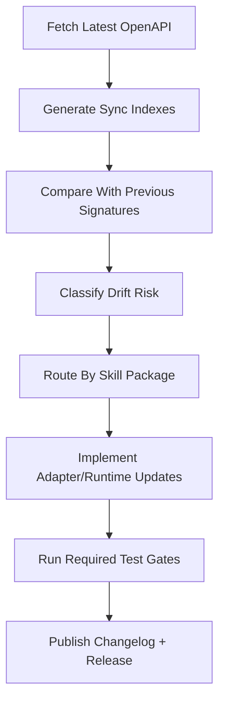

# 11 OpenAPI Sync Strategy

Status: Draft v1.0  
Last Updated: 2026-03-06

## 1. Objective
Define a deterministic synchronization strategy to track TikHub OpenAPI changes, classify drift risk, and drive safe skill updates across all packages.

This document closes the maintenance loop after release and observability phases.

## 2. Source Baseline
- OpenAPI source: `https://api.tikhub.io/openapi.json`
- Current snapshot metadata:
  - snapshot time (UTC): `2026-03-06T08:08:28Z`
  - file sha256: `de8b2af1336216216fc67ed8282c75cc8e2b85e304f14bbb0b9a7dc1930ea203`
  - OpenAPI version: `3.1.0`
  - API info version: `V5.3.2`
- Operation baseline: `987` (`GET=874`, `POST=113`)

## 3. Machine-Readable Sync Artifacts
Generated files:
- `11-OPENAPI-SNAPSHOT-METADATA.csv`
- `11-OPENAPI-OPERATION-SIGNATURES.csv`
- `11-OPENAPI-SYNC-SUMMARY-BY-PACKAGE.csv`
- `11-OPENAPI-SYNC-SUMMARY-BY-PLATFORM.csv`
- `11-OPENAPI-CHANGE-RISK-RULES.csv`

Drift comparison outputs:
- `11-OPENAPI-DRIFT-ADDED.csv`
- `11-OPENAPI-DRIFT-REMOVED.csv`
- `11-OPENAPI-DRIFT-SIGNATURE-CHANGED.csv`
- `11-OPENAPI-DRIFT-SUMMARY.csv`

Generation commands:
```bash
./scripts/generate_openapi_sync_indexes.sh /tmp/tikhub-openapi.json .
./scripts/diff_openapi_signatures.sh <old_signatures.csv> 11-OPENAPI-OPERATION-SIGNATURES.csv .
```

## 4. Ownership Baseline
By skill package:
- `skill-tikhub-global-social=396`
- `skill-tikhub-douyin-family=393`
- `skill-tikhub-video-community=158`
- `skill-tikhub-experimental=26`
- `skill-tikhub-core=14`

By platform (top 6):
- `douyin=247`
- `tiktok=204`
- `instagram=82`
- `xiaohongshu=68`
- `weibo=64`
- `bilibili=41`

These ownership views are the default routing input for drift triage and reviewer assignment.

## 5. Sync Trigger Policy (Locked)

### 5.1 Scheduled Trigger
- Run OpenAPI sync check at least once per day (UTC).
- If snapshot sha256 unchanged, skip downstream adaptation work and only log status.

### 5.2 Event Trigger
Force sync when any condition is met:
- TikHub announces API changes or new platform modules.
- Live incidents indicate contract drift (`CONTRACT_VIOLATION`).
- repeated `422`/`400` input failures suggest parameter contract changes.
- release planning requires latest inventory confirmation.

### 5.3 Manual Trigger
- Maintainers can trigger on demand before major releases or security hotfixes.

## 6. Drift Detection Model
Primary comparison key:
- `operation_id`

Secondary contract key:
- `operation_signature_sha256` from `11-OPENAPI-OPERATION-SIGNATURES.csv`

Drift categories and risk are governed by `11-OPENAPI-CHANGE-RISK-RULES.csv`, including:
- `operation_added`
- `operation_removed`
- `path_or_method_changed`
- `request_profile_changed`
- `response_profile_changed`
- `parameter_signature_changed`
- `response_schema_ref_changed`
- `operation_signature_hash_changed`

## 7. Sync Workflow



## 8. Risk-Based Action Policy

| Drift Type | Default Severity | Required Action |
|---|---|---|
| `operation_added` | medium | add adapter mapping + tests + changelog entry |
| `operation_removed` | high | mark breaking change and update migration notes |
| `path_or_method_changed` | high | update request route binding and integration tests |
| `request_profile_changed` | high | update serializer/content-type + fixtures |
| `response_profile_changed` | high | update parser/normalizer + contract tests |
| `parameter_signature_changed` | high | update validation rules + negative tests |
| `status_codes_changed` | medium | review retry/error mapping (Doc 03/06) |
| `operation_signature_hash_changed` | high | run full impacted-package regression |

## 9. Repository Sync Workflow Standard
Recommended directory convention:
- `snapshots/openapi/YYYYMMDD/openapi.json`
- `snapshots/openapi/YYYYMMDD/11-OPENAPI-OPERATION-SIGNATURES.csv`

Each sync PR must include:
- new snapshot metadata and signatures
- drift summary outputs
- impacted package list and risk level
- test evidence based on Doc 07 tiers
- release note impact labels (Doc 09)

Execution checklist template:
- `11-OPENAPI-SYNC-CHECKLIST.md`

## 10. CI Automation Baseline
Planned CI job (`openapi-sync-check`):
1. Download latest OpenAPI snapshot.
2. Generate 11-series sync artifacts.
3. Compare against last committed baseline signatures.
4. Fail/flag based on severity policy:
   - hard fail: `operation_removed`, `path_or_method_changed`, `response_profile_changed`, `parameter_signature_changed`
   - warn: `operation_added`, `status_codes_changed`
5. Produce artifact bundle for reviewer.

## 11. Integration With Existing Governance
- Doc 03: drift in status/timeout semantics must update runtime policy.
- Doc 05: request/response drift must update contract profile handling.
- Doc 06: error-surface drift must update category mapping when needed.
- Doc 07: test matrix and suites must be regenerated for impacted operations.
- Doc 08: new secret/cookie surfaces must be reclassified.
- Doc 09: breaking changes must be reflected in version bump and changelog.
- Doc 10: SLO/alert profile may need reranking for changed operations.

## 12. Acceptance Criteria
This phase is accepted when:
- OpenAPI snapshot and signature baselines are reproducible.
- drift categories and severity actions are deterministic.
- sync trigger policy is explicit.
- package routing and CI automation flow are defined.
- ready to execute Doc 12 contributing guide.

## 13. Exit Checklist
- [ ] Sync trigger policy approved
- [ ] Drift classification approved
- [ ] Risk action matrix approved
- [ ] CI sync baseline approved
- [ ] Sync checklist approved
