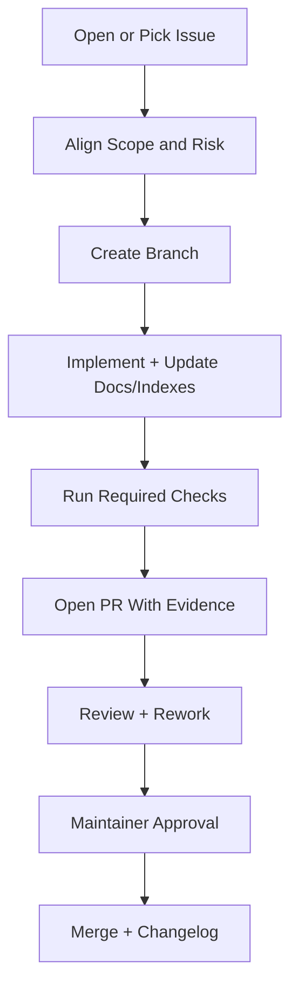

# 12 Contributing Guide

Status: Draft v1.0  
Last Updated: 2026-03-06

## 1. Objective
Define a clear, enforceable contributor workflow so external and internal contributors can deliver safe changes to TikHub skills with consistent quality.

This document is the collaboration contract for issue intake, implementation, review, and merge.

## 2. Scope
This guide applies to:
- all root governance docs (`01` to `12`)
- all scripts under `scripts/`
- all skill packages under `skills/`
- generated CSV artifacts tracked in repository root

## 3. Prerequisites For Contributors
- understand project baseline from `README.md`
- read required governance docs before non-trivial changes:
  - Doc 03 runtime policy
  - Doc 05 request/response contract
  - Doc 06 error model
  - Doc 07 test strategy
  - Doc 08 security/compliance
  - Doc 09 release/versioning
  - Doc 10 observability
  - Doc 11 OpenAPI sync

## 4. Contribution Types
- `docs`: governance docs, runbooks, checklists
- `scripts`: generator and drift tooling
- `skill-runtime`: shared runtime/auth/retry/error logic
- `skill-adapter`: endpoint mappings and serializers/parsers
- `tests`: unit/contract/integration/live-smoke scaffolding
- `ci`: automation for sync, test, and release gates

## 5. Branching Strategy (Locked)
- Base branch: `main`
- Feature branch naming:
  - `feat/<short-scope>`
  - `fix/<short-scope>`
  - `docs/<short-scope>`
  - `chore/<short-scope>`
- One branch should focus on one coherent change set.
- Avoid mixed mega-PRs spanning unrelated packages/domains.

## 6. Commit And PR Convention

### 6.1 Commit Format
Use Conventional Commits:
- `feat: ...`
- `fix: ...`
- `docs: ...`
- `refactor: ...`
- `test: ...`
- `chore: ...`

### 6.2 PR Title Format
`<type>(<scope>): 
`

Examples:
- `feat(runtime): add timeout policy override loader`
- `docs(sync): refine openapi drift risk matrix`
- `fix(adapter-douyin): correct pagination cursor mapping`

## 7. Contributor Workflow

## 8. Issue Intake And Triage
- Every non-trivial change should map to an issue.
- Issue should include:
  - problem statement
  - impacted package/platform/module
  - expected risk level (`low|medium|high`)
  - acceptance conditions
- Triage target:
  - high risk: first maintainer response within 24h
  - medium/low risk: first maintainer response within 3 business days

## 9. Implementation Requirements
- Keep behavior aligned with previous governance docs.
- If OpenAPI contract is touched:
  - regenerate related CSV files
  - include drift analysis outputs from Doc 11 workflow
- If runtime policy is touched:
  - update Doc 03/06/10 references as needed
- If security-sensitive paths are touched:
  - verify redaction and secret policies (Doc 08)

## 10. Required Checks Before PR
Minimum contributor self-check:
1. Relevant generator scripts rerun and outputs committed.
2. No accidental drift in unrelated generated files.
3. Security checklist items pass for touched scope.
4. Test evidence provided according to touched tier/risk.
5. Changelog or release note impact captured when applicable.

Operational checklists:
- `12-PR-CHECKLIST.md`
- `12-CODE-REVIEW-CHECKLIST.md`

## 11. PR Content Standard
Each PR description must include:
- summary of what changed
- why change is needed
- affected packages/platforms/modules
- generated files updated
- testing evidence (commands + result summary)
- risk and rollback note

For breaking changes:
- mark clearly as `BREAKING`
- provide migration instructions
- reference Doc 09 bump policy

## 12. Review Policy
- At least 1 maintainer approval required for docs/scripts-only changes.
- At least 2 maintainer approvals required for:
  - runtime core changes
  - high-risk contract changes
  - security policy changes
- Reviewer should verify:
  - policy compliance
  - correctness and edge-case handling
  - generated artifact consistency
  - release impact clarity

## 13. Merge Policy
- Default merge method: squash merge.
- Merge blocked when:
  - required checks fail
  - unresolved review conversations exist
  - required approvals are missing
  - generated artifact drift remains unexplained

## 14. Security And Incident Rules For Contributors
- Never commit active credentials or sensitive cookies.
- Redact all request/response samples containing sensitive data.
- If a contribution introduces incident or regression:
  - stop rollout
  - file incident record using Doc 06 template
  - add regression tests before closure

## 15. Documentation And Traceability Rules
- Governance-impacting code changes must update corresponding docs in same PR.
- All generated CSV changes should be reproducible from documented commands.
- Keep deterministic snapshots and drift evidence for OpenAPI-related updates.

## 16. New Contributor Quick Start
1. Fork/clone repository.
2. Fetch OpenAPI snapshot to `/tmp/tikhub-openapi.json`.
3. Run baseline generator commands from `README.md`.
4. Pick a small docs/scripts issue first.
5. Submit PR using `12-PR-CHECKLIST.md`.

## 17. Maintainer Decision Matrix

| Change Type | Risk | Required Review Depth |
|---|---|---|
| docs text only | low | policy consistency check |
| generator script behavior | medium | reproducibility + output diff review |
| adapter mapping | medium/high | contract correctness + tests |
| runtime retry/auth/error logic | high | multi-review + regression evidence |
| security policy or redaction logic | high | security-focused review mandatory |

## 18. Acceptance Criteria
This phase is accepted when:
- contributor workflow is clear end-to-end.
- PR/review standards are explicit and enforceable.
- ownership and approval policy are deterministic.
- security and incident expectations for contributors are clear.
- documentation baseline (Doc 01-12) is complete.

## 19. Exit Checklist
- [ ] Branch and commit conventions approved
- [ ] PR template and checklist approved
- [ ] Review policy approved
- [ ] Merge/traceability policy approved
- [ ] Contributor quick-start validated
